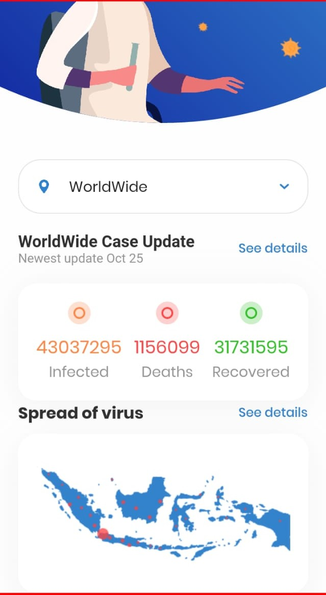
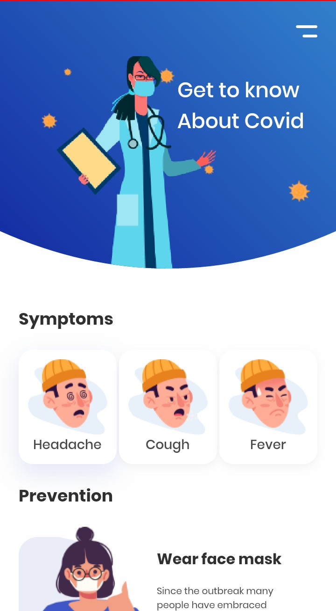
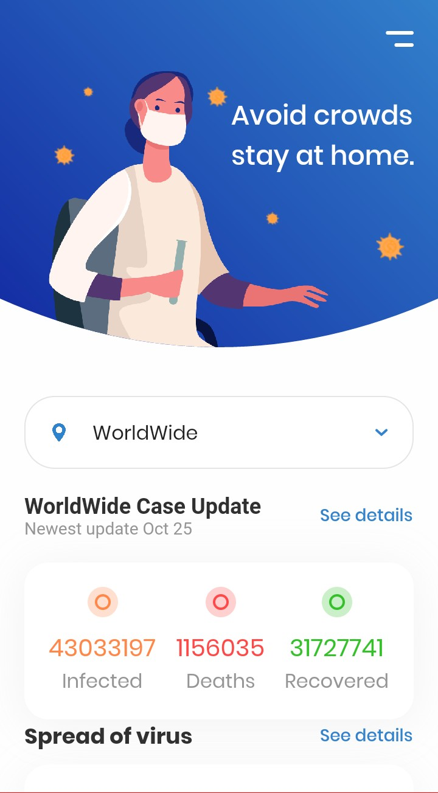

# Covid 19 Flutter

This project was generated with [Flutter](https://flutter.dev) 

### Prerequisites

Software you need to install the software and how to install them

```
Flutter 
```

# Development

Emulator(API level 29)
Flutter
VisualStudioCode

## Build

Enter into terminal
```
flutter pub get
```

<p float="left">



</p>


## Built With

* [Flutter](http://flutter.dev/) - The framework used
* [API](https://corona.lmao.ninja/v2/all) - The API used

 

## Further Help

AndroidDevs[Android Developers](https://developer.android.com/)

## Author

* **Author Name** - *Initial work* - [ferdinandmwal](https://github.com/ferdinandmwal123)


## Description

An app that  shows the current coronavirus cases from an API with a beautiful UI


## License

[](http://opensource.org/licenses/MIT)
This project is licensed under the MIT license.


 
